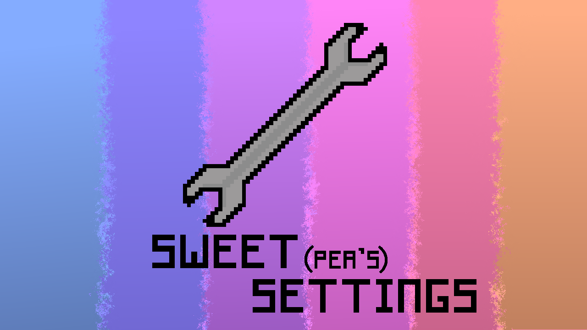

 

A drop-in settings menu for Godot 4.7+ games.

Ships with basic settings most games need and is built to be extended. Drop it straight into your game or treat it as a jumping-off point to restructure for your specific needs.

## Features

- **Ready-made defaults** - for gameplay, graphics, audio, and controls
- **Schema-driven UI** - settings are defined in JSON, not hardcoded. Add additional settings with a few lines.
- **Automatic keybinds** - Input Map actions are automatically parsed into editable bindings.
- **Simple, themeable UI** - style it with Godot themes, or swap/edit the components yourself

## Installation

### From GitHub

1. Download or clone this repo
2. Copy `addons/sweetpeas-settings` into your project's `addons/` folder
3. In **Project → Project Settings → Plugins**, enable **Sweetpea's Settings**

### From the Asset Store

1. Open **AssetStore** in the Godot editor
2. Search for **Sweetpea's Settings**
3. Download and install, then enable the plugin under **Project → Project Settings → Plugins**

Once enabled, the plugin adds the `SweetSettings` autoload. Instance `res://addons/sweetpeas-settings/ui/settings.tscn` wherever you want the menu (pause screen, options button, etc.).

### Project setup notes

**Custom appliers.** Call `SweetSettings.register_applier` from any autoload `_ready` (or later). Registrations before boot finishes are queued; registrations after boot apply the current stored value immediately.

**Audio buses.** The default schema only wires volume into Godot's built-in `Master` bus (`master_volume`). `music_volume`, `sfx_volume`, and `ui_volume` are included to demo the schema's `keys[]` batching — they won't do anything until you add matching buses (`Music`, `SFX`, `UI`) and route audio through them.

## Schema shape

Settings are defined in JSON under `addons/sweetpeas-settings/config/`. The shipped defaults live in `default_schema.json` — peek there for a full working example. The shape itself looks like this:

```json
{
	"version": 1.0,
	"sections": [
		{
			"id": "...",
			"label": "...",
			"settings_source": "...",
			"exclude_prefixes": [],
			"header": [],
			"footer": [],
			"settings": [
				{
					"key": "...",
					"type": "...",
					"label": "...",
					"default": ...,
					"default_source": "...",
					"min": ...,
					"max": ...,
					"step": ...,
					"suffix": "...",
					"display_scale": ...,
					"options": {},
					"options_source": "...",
					"disabled_when": {}
				},
				{
					"type": "...",
					"default": ...,
					"keys": ["...", "..."]
				}
			]
		}
	]
}
```

### Top level

| Field | Meaning |
|-------|---------|
| `version` | Schema version number. |
| `sections` | Array of tabs. Order here is tab order in the UI. |

### Section

Each section is one tab.

| Field | Meaning |
|-------|---------|
| `id` | Section id. Tab label is humanized from this unless `label` is set. Also used for i18n. |
| `label` | Optional display name override for the tab. |
| `settings` | Array of setting dictionaries for this tab. |
| `settings_source` | Optional injector. `"input_map"` pulls Project Settings Input Map actions in as keybinds. |
| `exclude_prefixes` | Optional. With `input_map`, skip actions whose names start with these prefixes. |
| `header` / `footer` | Optional extra UI components above/below the setting rows. |

### Setting

Each entry in `settings` becomes one or more rows.

| Field | Meaning |
|-------|---------|
| `key` | Id for a single setting. One row, one stored value. Display text is `tr(key)` unless overridden. |
| `keys` | Batch of ids that share this entry's other fields. Expands into separate settings at load (e.g. several volume sliders from one dict). Use instead of `key`. |
| `type` | Which editor to show (see below). |
| `label` | Optional display name override. Passed through `tr()`. |
| `default` | Starting value before the player changes anything. |
| `default_source` | Optional. Fill `default` from the runtime environment (`system_locale`, `primary_resolution`). Overrides `default` when it resolves. |
| `min` / `max` / `step` | Range/step for numeric types (`numeric_slider`, `spinbox`). |
| `suffix` | Optional. Text shown after a `numeric_slider` value (e.g. `"%"`). |
| `display_scale` | Optional. Multiplies the stored value for display on `numeric_slider` (e.g. `100` to show `0.1` as `10`). |
| `options` | Choices for `option` types — a `{ "Label": value }` map, a list of values, or `[{ "value", "label" }, ...]`. |
| `options_source` | Optional. Fill `options` from the runtime environment (`project_locales`, `display_resolutions`). Replaces static `options` when it resolves. |
| `disabled_when` | Optional. Disable this setting when another setting's value is in the given list. |

Use `key` for one-offs. Use `keys` when several settings share the same shape.

### Built-in types

| Type | Control |
|------|---------|
| `toggle` | On/off checkbox |
| `option` | Dropdown |
| `spinbox` | Numeric spin box |
| `numeric_slider` | Slider (supports display scaling / suffix) |
| `keybind` | Rebindable input (also injected from the Input Map) |

## Extending the settings

### Edit the default schema

The built-in list lives at:

```
addons/sweetpeas-settings/config/default_schema.json
```

Add new settings or tweak the current ones to match your game.

### Override with your own schema

Drop another `.json` file into the same `config/` folder. At runtime, any custom schema takes priority over `default_schema.json` (if several custom files exist, the first alphabetically wins).

That lets you keep the addon updatable while defining your own settings shape without editing the shipped default.

### Auto keybinds from the Input Map

Add actions in **Project → Project Settings → Input Map**. The controls section uses `"settings_source": "input_map"`, so those actions are injected as editable keybinds automatically — no schema entries required per action.

Use `exclude_prefixes` on that section if you want to hide engine/internal actions.

Actions can have multiple keyboard and controller bindings. The keybind editor shows them as aligned pair-rows; use **+** to add another pair. If the same input is assigned to two different actions, both slots show a yellow conflict badge — bindings are not auto-cleared.

## Styling & customization

The UI is intentionally simple: tabs, rows, and value editors. It is meant to get you running, not lock you into one look.

A small theme ships at `addons/sweetpeas-settings/theme/sweetpeas_settings.tres` with a few custom colors. Extend it, fold those entries into your project's theme, or apply a different theme to the settings scene (or a parent) to restyle controls.

Properties specific to this addon live under the `SweetSettings` theme type, so a matching entry in your own theme overrides them:

| Theme item | Effect |
|------------|--------|
| `SweetSettings/colors/conflict_icon_modulate` | Tint applied to a keybind icon that is bound to more than one action |

Standard controls (buttons, sliders, dropdowns) style through normal Godot theme inheritance.

- Edit or replace the scenes under `ui/` and `components/` to change layout and behavior
- Wire custom appliers via `SweetSettings` when a setting needs to affect your own systems

## Default sections

| Section    | Examples                                      |
|------------|-----------------------------------------------|
| Gameplay   | Language, mouse sensitivity                   |
| Graphics   | Resolution, display mode, VSync, max FPS      |
| Audio      | Master / music / SFX / UI volume              |
| Controls   | Keybinds from your project's Input Map        |

## Progress

I intend to maintain and update this repo when necessary. Don't expect regular or timely updates.

## License

MIT — see [LICENSE](LICENSE).

Keybind prompt icons are from [Kenney's Input Prompts](https://kenney.nl/assets/input-prompts) (CC0). See `addons/sweetpeas-settings/licenses/third-party/kenney-input-prompts.txt`.
